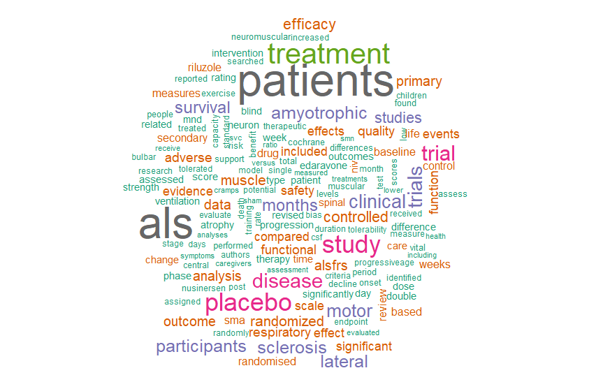
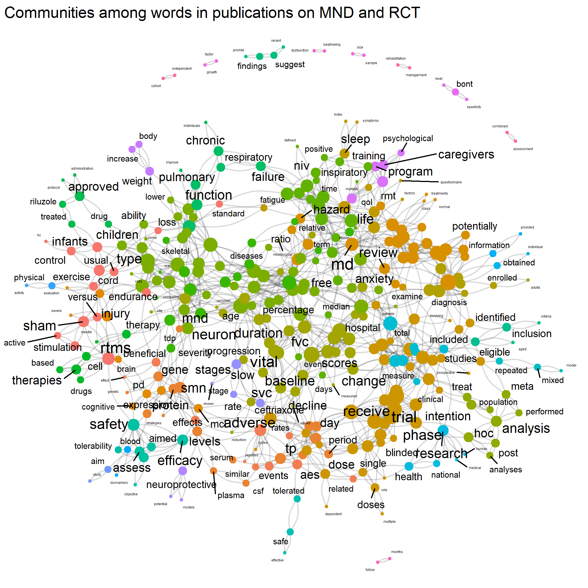

# MND
Research themes in MND

This is an evaluation of papers published in Pubmed on MND and RCT from 2011 to 2021. The data is displayed using wordclouds. 

Publications in High Impact Factor Journals|Publications in General Journals|Publications in Neurology Journals
---|---|---
||
---

The analysis use cluster detection method to determine relationship among words. Finally topic modelling is performed using Latent Dirichlet Allocation. This can be accessed at https://gntem2.github.io/MND/.
